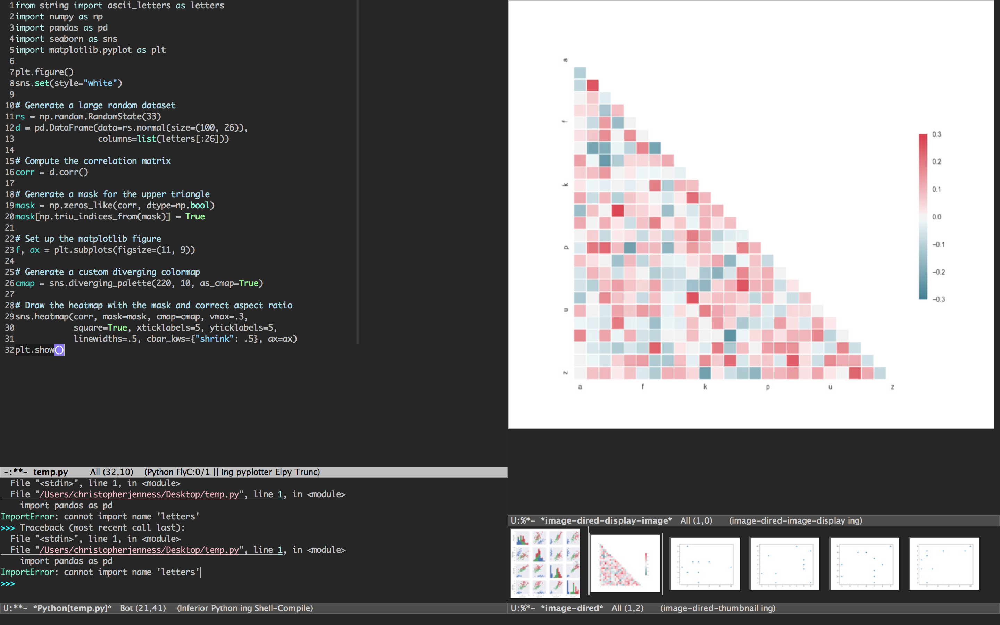

# pyplotter
Python IDE for working with plots and data

## Overview

Pyplotter is a minor mode built on top of elpy.  The idea is to be able to handle plots in a natural way, similar [RStudio](https://www.rstudio.com/
) or [Rodeo](https://www.yhat.com/products/rodeo).

As you can see in the screenshot above, on the left is a python file and REPL.  The main functionality is on the right.  Any plots generated are loaded into the thumbnail viewer on the bottom right hand corner.  These can be browsed and displayed in the top right window.

The other basic functionality (not yet implemented) is to be able to inspect variables (pandas DataFrames, etc) so they do not need to be printed to inspect.

## Installation

Copy `pyplotter.el` to your load path.

Add `(require 'pyplotter)` to your `.emacs` file

## Usage

In any elpy buffer, press `M-x pyplotter-mode`.  This will initialize all the functionality.  People like their windows ordered in different ways, so you will need to customize the layout yourself.

The typical `elpy` function to send code to the REPL is `elpy-shell-send-region-or-buffer`.  Instead, if you want to utilize pyplotters thumbnail browser, use `pyplotter-shell-send-region-or-buffer`.  This will send any plots generated to the thumbnail viewer.

By default, `pyplotter-shell-send-region-or-buffer` is bound to `C-c f`.

# Contributing

pyplotter has many [issues](https://github.com/christopherjenness/pyplotter/issues).
